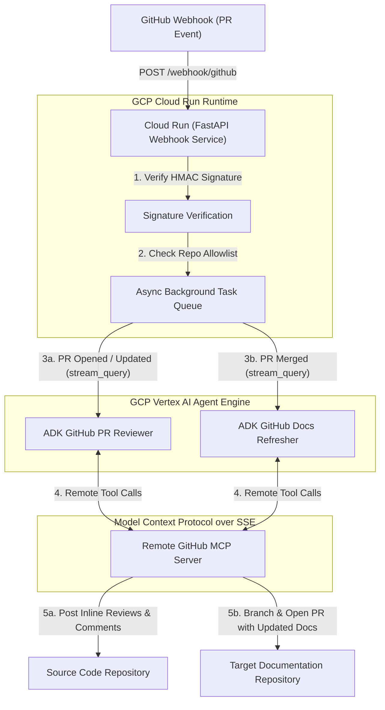

# ADK Automated GitHub PR Reviewer & Docs Refresher

An intelligent, multi-agent AI system built on the **Google Agent Development Kit (ADK)** and **Gemini 3.5 Flash via Vertex AI**. This service integrates directly with remote GitHub MCP servers over Streamable HTTP to autonomously review Pull Requests and keep repository documentation synchronized.

---

## 🏗️ System Architecture & End-to-End Workflow

The system decouples event handling from heavy LLM agent execution by leveraging **GCP Cloud Run** for instantaneous webhook processing and **GCP Vertex AI Agent Engine** for autonomous reasoning and MCP tool execution.



### Detailed Workflow Details
1. **Instantaneous Event Ingestion**: When a developer opens, updates, or merges a Pull Request on GitHub, GitHub posts an event payload (`pull_request`) to the webhook service hosted on **GCP Cloud Run**.
2. **Security & Validation**: The Cloud Run service verifies the request integrity using HMAC SHA-256 signatures (`GITHUB_WEBHOOK_SECRET`) and checks if the source repository is authorized (`ALLOWED_CODE_REPOS`).
3. **Asynchronous Dispatch**: To comply with GitHub's strict 10-second webhook timeout, Cloud Run immediately returns `202 Accepted` to GitHub and queues a non-blocking asyncio background task (`asyncio.to_thread`) to stream the prompt to the remote reasoning engine.
4. **Autonomous Reasoning on Agent Engine**:
   - **On PR Open / Push (`opened` / `synchronize`)**: Queries the deployed `ADK GitHub PR Reviewer` instance on Vertex AI Agent Engine. The agent connects to the remote GitHub MCP server (`api.githubcopilot.com/mcp/sse`), analyzes line diffs, and submits line-by-line inline review comments directly onto the Pull Request.
   - **On PR Merge (`closed` + `merged`)**: Queries the deployed `ADK GitHub Docs Refresher` instance on Vertex AI Agent Engine. The agent inspects the merged diffs, explores existing `.md` files in the target repository (`DOCS_TARGET_REPO`), creates a new branch, commits necessary documentation updates, and opens a documentation pull request.

---

## ⚙️ Setup & Configuration

1. **Install Dependencies**:
   Ensure you have Python 3.13+ and [uv](https://docs.astral.sh/uv/) installed:
   ```bash
   uv sync
   ```

2. **Configure `.env`**:
   Copy `.env.example` to `.env`:
   ```bash
   cp .env.example .env
   ```
   Open `.env` and provide your credentials and routing preferences:
   ```ini
   # Vertex AI Configuration
   GCP_PROJECT_ID=your-gcp-project-id
   GCP_REGION=us-central1
   GOOGLE_GENAI_USE_VERTEXAI=1

   # Remote GitHub MCP Authentication
   GITHUB_PERSONAL_ACCESS_TOKEN=github_pat_...
   GITHUB_MCP_SSE_URL=https://api.githubcopilot.com/mcp/sse

   # Webhook Security & Filtering
   GITHUB_WEBHOOK_SECRET=your_webhook_secret_passphrase
   ALLOWED_CODE_REPOS=owner/repo-name

   # Docs Refresher Target Repository
   DOCS_TARGET_REPO=owner/repo-docs
   ```

---

## 🚀 Usage Modes

### 1. Interactive Web UI (`adk web`)
Test and converse with either agent interactively through ADK's built-in web developer interface:
```bash
# Launch UI for pr_reviewer
uv run adk web pr_reviewer

# Launch UI for docs_refresher
uv run adk web docs_refresher
```

### 2. Command-Line Runner (`run_agent.py`)
Run ad-hoc queries from the terminal against `pr_reviewer`:
```bash
uv run run_agent.py "Show the last commit in owner/repo"
```

### 3. Live Webhook Server (Local Tunneling)
Start the local FastAPI server to process incoming GitHub webhooks:
```bash
uv run python -m webhook_service.main
```
Expose local port `8080` instantly to GitHub without any account signups via SSH tunneling:
```bash
ssh -R 80:localhost:8080 nokey@localhost.run
```
Copy the forwarding URL (`https://xxxx.localhost.run`) and paste it into your GitHub repository settings under **Settings** → **Webhooks** → **Add webhook** (Payload URL: `https://xxxx.localhost.run/webhook/github`).

---

## ☁️ Deployment to GCP (Vertex AI Agent Engine & Cloud Run)

### 1. Deploy Reasoning Engines to Vertex AI Agent Engine (with OpenTelemetry)
Deploy the autonomous agents to Vertex AI Agent Engine using the provided scripts. These scripts automatically pass `--otel_to_cloud` to enable native OpenTelemetry observability, exporting spans, traces, and metrics directly to GCP Cloud Trace and Cloud Logging:
```bash
# Deploy PR Reviewer (with OpenTelemetry enabled)
./deploy_pr_reviewer_to_ae.sh

# Deploy Docs Refresher (with OpenTelemetry enabled)
./deploy_docs_refresher_to_ae.sh
```
After deploying, copy the returned `Agent Engine ID` values into your `.env` file as `PR_REVIEWER_ENGINE_ID` and `DOCS_REFRESHER_ENGINE_ID`.

### 2. Deploy Webhook Service to Cloud Run
Deploy the lightweight FastAPI event handler to Cloud Run using the automated deployment script:
```bash
./deploy_webhook_to_cr.sh
```
Once deployed, update your GitHub Webhook configuration with the assigned Cloud Run HTTPS URL (e.g., `https://github-webhook-service-xyz-uc.a.run.app/webhook/github`).
