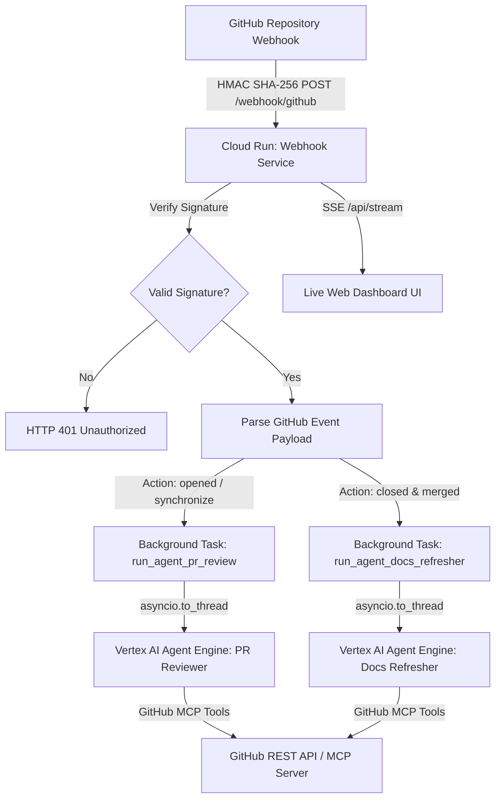

# ADK GitHub AI Agent & Webhook Service Architecture

## 1. Executive Summary
The ADK GitHub AI Agent system is a highly modular, event-driven architecture designed to provide automated, AI-powered Pull Request (PR) code reviews and continuous documentation synchronization. The system consists of a Google Cloud Run webhook receiver (`webhook_service`) that listens to GitHub repository events and delegates complex, multi-step agent reasoning to Google Cloud Vertex AI Agent Engine (`pr_reviewer` and `docs_refresher`).

---

## 2. System Architecture & Component Design

### 2.1 Webhook Service (`webhook_service/`)
The `webhook_service` is an asynchronous FastAPI application deployed on Google Cloud Run (`roles/run.invoker`).
- **Core Responsibilities:**
  1. **Secure Ingestion:** Validates incoming webhook headers (`X-Hub-Signature-256`) against `GITHUB_WEBHOOK_SECRET` using `verify_signature()` (HMAC SHA-256).
  2. **Event Dispatching:** Inspects event payloads (`pull_request`) and dispatches long-running agent workflows (`run_agent_pr_review`, `run_agent_docs_refresher`) to FastAPI `BackgroundTasks` to ensure non-blocking HTTP `200 OK` responses back to GitHub within the 10-second timeout window.
  3. **Live Observability:** Maintains an in-memory ring buffer of execution events broadcast via Server-Sent Events (SSE) on `/api/stream`, consumed by the live web UI (`/`).

### 2.2 Vertex AI Agent Engine Integration (`engine_client.py`)
Agent execution is offloaded to remote Reasoning Engines deployed on Google Cloud Vertex AI:
- **`PR_REVIEWER_ENGINE_ID`**: Executes the code review agent, which leverages GitHub MCP tools (`get_pull_request`, `get_pull_request_files`, `pull_request_review_write`, `add_comment_to_pending_review`) to analyze file diffs and submit structured review comments.
- **`DOCS_REFRESHER_ENGINE_ID`**: Executes the documentation agent upon PR merge, inspecting changed source files against existing markdown documentation in target documentation repositories (`{repo}-docs`) and automatically opening synchronization PRs.

---

## 3. Data Flow & Concurrency Model

1. **Non-Blocking Background Tasks:** 
   GitHub webhooks require fast acknowledgment (< 10 seconds). All interactions with Vertex AI Reasoning Engines (`query_remote_agent`) are wrapped in `asyncio.to_thread(get_remote_engine, ...)` inside FastAPI `BackgroundTasks` to prevent thread starvation.
2. **Streaming Event Broadcaster (`broadcaster.py`):**
   The service uses a thread-safe ring buffer (`maxlen=200`) along with `asyncio.Queue` subscribers for Server-Sent Events (`sse_event_generator`). When agents start, progress, or encounter errors, formatted status frames (`AGENT_START`, `TOOL_CALL`, `AGENT_DONE`, `ERROR`) are streamed immediately to connected browser clients.

---

## 4. Deployment & Infrastructure Boundaries
- **Containerization:** Built via multi-stage or standard `Dockerfile` under Python 3.11/3.12 (`python:3.11-slim`), using `uv` for deterministic dependency resolution (`uv.lock`).
- **Secret Management:** Secrets (`GITHUB_WEBHOOK_SECRET`, `GITHUB_PERSONAL_ACCESS_TOKEN`) must never be hardcoded and should be injected via Google Cloud Secret Manager when running in production Cloud Run environments.
