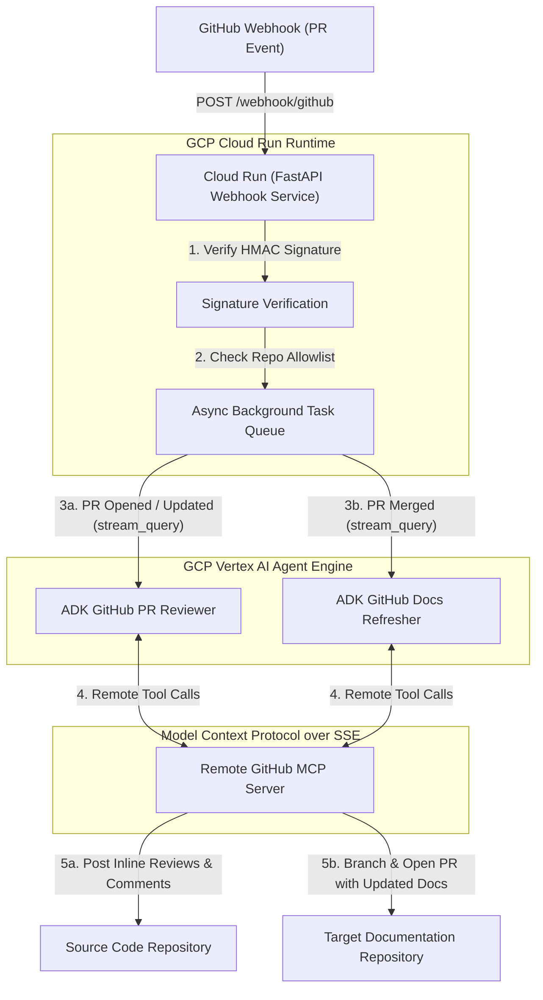

# ADK GitHub PR Reviewer Webhook Service

A lightweight FastAPI service designed to listen for GitHub webhooks (`pull_request` events) and autonomously invoke the **ADK GitHub Agent** (Gemini 2.5 Flash + remote GitHub MCP server) to perform code reviews and post comments on Pull Requests.

---

## 📁 Folder Structure

```
webhook_service/
├── __init__.py
├── main.py        # FastAPI webhook server & agent background task runner
├── Dockerfile     # Cloud Run multi-stage Dockerfile
└── README.md      # Deployment & running instructions
```

---

## 🏗️ Architecture & Workflow



### Event Handling Lifecycle
1. **Instantaneous Acceptance**: GitHub sends a `pull_request` payload. The FastAPI endpoint checks the HMAC SHA-256 signature against `GITHUB_WEBHOOK_SECRET` and verifies the source repo against `ALLOWED_CODE_REPOS`. It queues a background task and responds with `202 Accepted` in milliseconds.
2. **Dynamic Remote Engine Discovery**: Inside the background task, the service checks `.env` for `PR_REVIEWER_ENGINE_ID` / `DOCS_REFRESHER_ENGINE_ID` (or dynamically scans Vertex AI reasoning engines) and caches the gRPC client connection.
3. **Autonomous Execution**: The service calls `stream_query_reasoning_engine(class_method="async_stream_query")` on Vertex AI Agent Engine. The agent autonomously queries the remote GitHub MCP server to read file diffs and execute actions (posting line-by-line review comments or creating PRs with refreshed documentation).

---

## 🚀 Running Locally (SSH Tunneling)

You can easily test webhook deliveries locally without creating any third-party account signups by using built-in SSH tunneling (`localhost.run`):

1. **Ensure environment variables are configured** in `.env`:
   ```ini
   GCP_PROJECT_ID=ninghai-ccai
   GCP_REGION=us-central1
   PR_REVIEWER_ENGINE_ID=7558920889367003136
   DOCS_REFRESHER_ENGINE_ID=240571494889947136
   GITHUB_WEBHOOK_SECRET=your_secret_passphrase
   ```

2. **Start the local FastAPI webhook server**:
   ```bash
   uv run python -m webhook_service.main
   ```
   *Server will listen on `http://localhost:8080`.*

3. **Expose localhost to GitHub using SSH tunneling**:
   In a separate terminal, run:
   ```bash
   ssh -R 80:localhost:8080 nokey@localhost.run
   ```
   *Copy the generated HTTPS forwarding URL (e.g., `https://xxxx.localhost.run`).*

4. **Configure GitHub Webhook**:
   - Go to your repository **Settings** → **Webhooks** → **Add webhook**
   - **Payload URL**: `https://<your-localhost-run-domain>/webhook/github`
   - **Content type**: `application/json`
   - **Secret**: Your value from `GITHUB_WEBHOOK_SECRET`
   - **Events**: Select **Pull requests**

---

## ☁️ Deploying to Google Cloud Run

To deploy this service as a scalable, serverless event handler on Google Cloud Run:

1. **Ensure Vertex AI Agent Engine IDs are configured** in your root `.env` file:
   ```ini
   GCP_PROJECT_ID=ninghai-ccai
   GCP_REGION=us-central1
   PR_REVIEWER_ENGINE_ID=7558920889367003136
   DOCS_REFRESHER_ENGINE_ID=240571494889947136
   GITHUB_WEBHOOK_SECRET=your_secret_passphrase
   ALLOWED_CODE_REPOS=owner/repo-name
   DOCS_TARGET_REPO=owner/repo-docs
   ```

2. **Deploy using the automated deployment script** (from the repository root directory):
   ```bash
   ./deploy_webhook_to_cr.sh
   ```
   *This script automatically copies `webhook_service/Dockerfile` to `./Dockerfile` for Cloud Build packaging, deploys `github-webhook-service` to Cloud Run, and passes all required environment variables into the container runtime.*

3. **Configure your GitHub Webhook**:
   - Go to your repository **Settings** → **Webhooks** → **Add webhook**
   - **Payload URL**: Enter your newly assigned Cloud Run HTTPS Service URL (e.g., `https://github-webhook-service-xyz-uc.a.run.app/webhook/github`)
   - **Content type**: `application/json`
   - **Secret**: Your value from `GITHUB_WEBHOOK_SECRET`
   - **Events**: Select **Pull requests**
