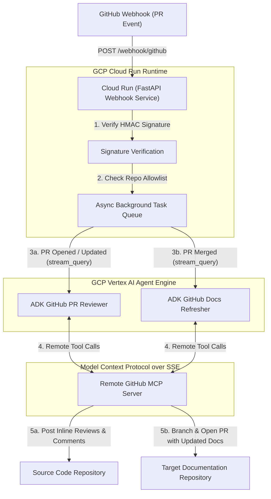

# ADK GitHub PR Reviewer Webhook Service

A production-ready FastAPI service designed to listen for GitHub webhooks (`pull_request` events), surface a **Stunning Live Streaming Web UI** (`GET /`), and autonomously invoke remote ADK agents on GCP Vertex AI Agent Engine to perform automated code reviews and documentation refreshes.

---

## ⚡ Features
- **Live Observability Dashboard**: Serve a rich glassmorphism Web UI directly at root (`GET /`) over Server-Sent Events (`/api/stream`) to broadcast real-time reasoning chunks, tool executions, and PR activity cards during live demos.
- **Asynchronous Non-Blocking Execution**: Instantaneous `202 Accepted` webhook returns via `asyncio.to_thread` workers.
- **Enterprise Security**: HMAC SHA-256 webhook signature verification (`GITHUB_WEBHOOK_SECRET`) and repository allowlists (`ALLOWED_CODE_REPOS`).

---

## 📁 Folder Structure

```
webhook_service/
├── __init__.py
├── main.py        # FastAPI webhook server, SSE live dashboard & background task runner
├── Dockerfile     # Cloud Run multi-stage Dockerfile
└── README.md      # Deployment & running instructions
```

---

## 🏗️ Architecture & Workflow



### Event Handling Lifecycle
1. **Instantaneous Acceptance**: GitHub sends a `pull_request` payload. The FastAPI endpoint checks the HMAC SHA-256 signature against `GITHUB_WEBHOOK_SECRET` and verifies the source repo against `ALLOWED_CODE_REPOS`. It queues a background task and responds with `202 Accepted` in milliseconds.
2. **Dynamic Remote Engine Discovery**: Inside the background task, the service checks `.env` for `PR_REVIEWER_ENGINE_ID` / `DOCS_REFRESHER_ENGINE_ID` (or dynamically scans Vertex AI reasoning engines) and caches the gRPC client connection.
3. **Autonomous Execution**: The service calls `stream_query_reasoning_engine(class_method="async_stream_query")` on Vertex AI Agent Engine. The agent autonomously queries the remote GitHub MCP server to read file diffs and execute actions (posting line-by-line review comments or creating PRs with refreshed documentation).

### 15-Step End-to-End Walkthrough
1. **Developer Code Change**: A user makes code modifications in a feature branch (e.g., `dev`) of the source repository (`gcp-scratch`).
2. **Git Commit**: The user commits the changes locally or via IDE.
3. **PR Creation**: The user creates a Pull Request from `dev` to the `main` branch.
4. **PR Submission**: The user submits the Pull Request on GitHub.
5. **Webhook Dispatch**: GitHub fires an HTTP POST webhook event (`pull_request` action: `opened`) to Cloud Run.
6. **Agent Engine Invocation**: Cloud Run verifies HMAC signatures and asynchronously invokes the deployed `ADK GitHub PR Reviewer` on Vertex AI Agent Engine.
7. **Retrieve PR Details**: The PR Reviewer agent queries the remote GitHub MCP server (`get_pull_request`, `get_pull_request_files`) over SSE to retrieve the file diffs and metadata.
8. **LLM Code Review**: The PR Reviewer passes the diffs to Gemini 2.5 Pro to evaluate code quality, detect potential bugs, and generate both high-level summary review comments and exact line-by-line code suggestions.
9. **Register Review Comments**: The PR Reviewer invokes GitHub MCP tools (`pull_request_review_write`, `add_comment_to_pending_review`) to post the review and inline comments directly onto the Pull Request in GitHub.
10. **PR Merge**: The developer addresses the review feedback and merges the Pull Request into `main`.
11. **Second Webhook Dispatch**: GitHub sends a second webhook event (`pull_request` action: `closed`, `merged: true`) to Cloud Run.
12. **Docs Refresher Invocation**: Cloud Run detects the merge event and asynchronously invokes the deployed `ADK GitHub Docs Refresher` on Vertex AI Agent Engine.
13. **Retrieve Current Docs & Diffs**: The Docs Refresher agent queries the remote GitHub MCP server to inspect the merged code changes and fetch existing markdown files from the target documentation repository (`gcp-scratch-docs`).
14. **LLM Documentation Generation**: The Docs Refresher calls Gemini 2.5 Pro to synthesize required documentation updates, reference guides, or new architecture summaries reflecting the merged changes.
15. **Open Docs PR**: The Docs Refresher invokes GitHub MCP server tools to create a new branch in `gcp-scratch-docs`, commit the updated markdown files, and submit a new documentation Pull Request for final human approval.

---

## 🚀 Running Locally (SSH Tunneling)

You can easily test webhook deliveries locally without creating any third-party account signups by using built-in SSH tunneling (`localhost.run`):

1. **Ensure environment variables are configured** in `.env`:
   ```ini
   GCP_PROJECT_ID=ninghai-ccai
   GCP_REGION=us-central1
   PR_REVIEWER_ENGINE_ID=7558920889367003136
   DOCS_REFRESHER_ENGINE_ID=240571494889947136
   GITHUB_WEBHOOK_SECRET=your_secret_passphrase
   ```

2. **Start the local FastAPI webhook server**:
   ```bash
   uv run python -m webhook_service.main
   ```
   *Server will listen on `http://localhost:8080`.*

3. **Expose localhost to GitHub using SSH tunneling**:
   In a separate terminal, run:
   ```bash
   ssh -R 80:localhost:8080 nokey@localhost.run
   ```
   *Copy the generated HTTPS forwarding URL (e.g., `https://xxxx.localhost.run`).*

4. **Configure GitHub Webhook**:
   - Go to your repository **Settings** → **Webhooks** → **Add webhook**
   - **Payload URL**: `https://<your-localhost-run-domain>/webhook/github`
   - **Content type**: `application/json`
   - **Secret**: Your value from `GITHUB_WEBHOOK_SECRET`
   - **Events**: Select **Pull requests**

---

## ☁️ Deploying to Google Cloud Run

To deploy this service as a scalable, serverless event handler on Google Cloud Run:

1. **Ensure Vertex AI Agent Engine IDs are configured** in your root `.env` file:
   ```ini
   GCP_PROJECT_ID=ninghai-ccai
   GCP_REGION=us-central1
   PR_REVIEWER_ENGINE_ID=7558920889367003136
   DOCS_REFRESHER_ENGINE_ID=240571494889947136
   GITHUB_WEBHOOK_SECRET=your_secret_passphrase
   ALLOWED_CODE_REPOS=owner/repo-name
   DOCS_TARGET_REPO=owner/repo-docs
   ```

2. **Deploy using the automated deployment script** (from the repository root directory):
   ```bash
   sh deployment/deploy_webhook_to_cr.sh
   ```
   *This script automatically copies `webhook_service/Dockerfile` to `./Dockerfile` for Cloud Build packaging, deploys `github-webhook-service` to Cloud Run, and passes all required environment variables into the container runtime.*

3. **Configure your GitHub Webhook**:
   - Go to your repository **Settings** → **Webhooks** → **Add webhook**
   - **Payload URL**: Enter your newly assigned Cloud Run HTTPS Service URL (e.g., `https://github-webhook-service-xyz-uc.a.run.app/webhook/github`)
   - **Content type**: `application/json`
   - **Secret**: Your value from `GITHUB_WEBHOOK_SECRET`
   - **Events**: Select **Pull requests**
